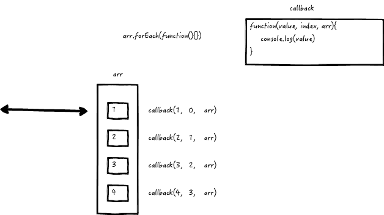
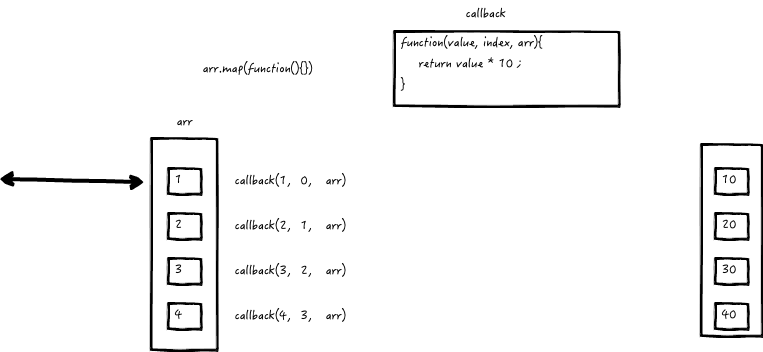
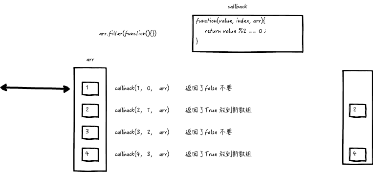
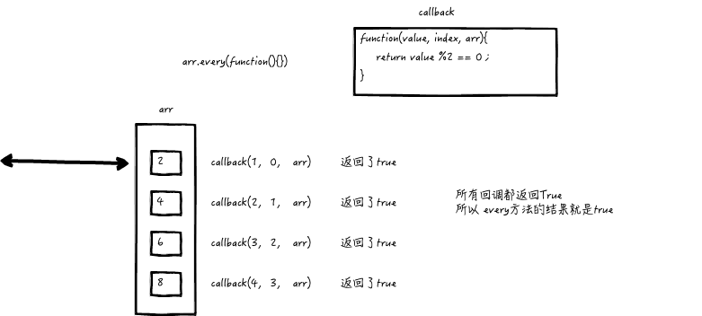
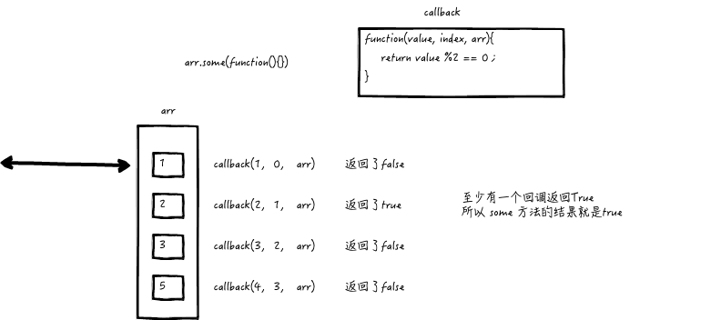
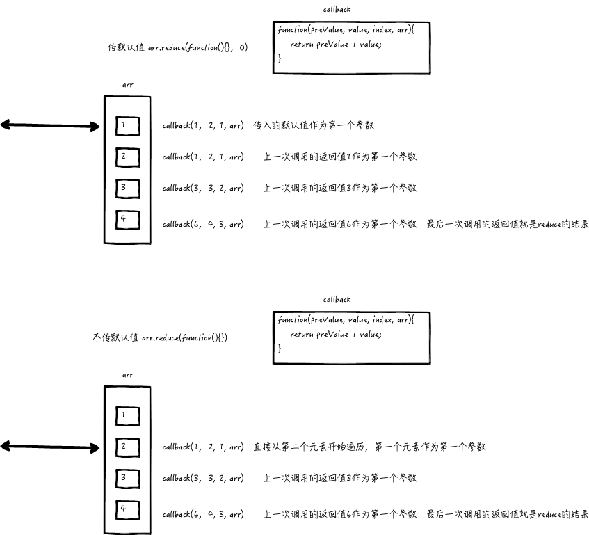

# ES5 数组方法


## forEach 方法

`forEach()` 方法对数组内的每个元素执行一次给定的函数。

### 语法

```javascript
arr.forEach(callback(currentValue [, index [, array]])[, thisArg])

// callback
  // 为数组中每个元素执行的函数，该函数接收一至三个参数：
    // currentValue
      // 数组中正在处理的当前元素。
    // index 可选
      // 数组中正在处理的当前元素的索引。
    // array 可选
      // 调用了 forEach() 方法的数组。
```


```javascript
// 遍历输出数组中的每一个内容
var arr = [0, 1, 2, 3, 4]
arr.forEach(function(value, index, arr){
	console.log(value, index, arr);
})
```



## map 方法

`map()` 方法会创建一个新数组，数组存储的是原数组中的每个元素调用一次提供的函数的返回值。

```javascript
var new_array = arr.map(function callback(currentValue[, index[, array]]) {
 // 需要有 return 语句，为新数组返回元素 
}[, thisArg])

// callback
  // 为数组中每个元素执行的函数，该函数接收一至三个参数：
    // currentValue
      // 数组中正在处理的当前元素。
    // index 可选
      // 数组中正在处理的当前元素的索引。
    // array 可选
      // 调用了 map() 方法的数组。
```


```javascript
// 创建一个新数组，里面的每个元素是原数组中每个元素的10倍
var arr = [0, 1, 2, 4]
arr.map(function(value, index, arr){
  return value * 10;
})
```



##filter方法

`filter()` 方法会创建一个新数组, 数组中存储的是原数组中所有调用提供的回调函数后返回`true`的元素。

```javascript
var newArray = arr.filter(callback(element[, index[, array]])[, thisArg])

// callback
  // 为数组中每个元素执行的函数，该函数接收一至三个参数：
    // currentValue
      // 数组中正在处理的当前元素。
    // index 可选
      // 数组中正在处理的当前元素的索引。
    // array 可选
      // 调用了 filter() 方法的数组。
```


```js
// 找到数组中所有的偶数
var arr = [0, 1, 2, 4, 5, 6, 7, 8]
var evenArr = arr.filter(function(value, index, arr){
  return value % 2 == 0;
})
```



## every 方法

`every()` 方法返回一个布尔值，用于测试一个数组内的所有元素是否满足指定的条件。

```javascript
arr.every(callback(element[, index[, array]])[, thisArg])

// callback
  // 为数组中每个元素执行的函数，该函数接收一至三个参数：
    // currentValue
      // 数组中正在处理的当前元素。
    // index 可选
      // 数组中正在处理的当前元素的索引。
    // array 可选
      // 调用了 every() 方法的数组。
```

```js
// 判断数组中元素是否所有元素都是偶数
var arr = [0, 1, 2, 4, 5, 6, 7, 8]
var evenArr = arr.every(function(value, index, arr){
  return value % 2 == 0;
})
```



## some 方法

`some()` 方法返回一个布尔值，用于测试数组中是不是至少有1个元素满足指定的条件。

```javascript
arr.some(callback(element[, index[, array]])[, thisArg])

// callback
  // 为数组中每个元素执行的函数，该函数接收一至三个参数：
    // currentValue
      // 数组中正在处理的当前元素。
    // index 可选
      // 数组中正在处理的当前元素的索引。
    // array 可选
      // 调用了 every() 方法的数组。
```

```js
// 判断数组中元素是否包含奇数
var arr = [2, 4, 5, 6, 8]
var evenArr = arr.every(function(value, index, arr){
  return value % 2 !== 0;
})
```



## reduce 方法

`reduce()` 方法接收一个函数作为累加器（accumulator），数组中的每个值（从左到右）开始合并，最终为一个值。

```
arr.reduce(callback(accumulator, currentValue[, index[, array]])[, initialValue])

// callback
  // 为数组中每个元素执行的函数（如果没有提供initialValue则不包含第一个元素），该函数接收四个参数：
  	// accumulator
  		// 上一次调用回调时返回的累积值或者initalValue
    // currentValue
      // 数组中正在处理的当前元素。
    // index 可选
      // 数组中正在处理的当前元素的索引。
    // array 可选
      // 调用了 reduce() 方法的数组。
// initialValue
		//作为第一次调用 callback函数时的第一个参数的值
```


```js
// 数组求和
var arr = [1, 2, 3, 4]
arr.reduce(function(accumulator, currentValue){
  return accumulator + currentValue;
})

arr.reduce(function(accumulator, currentValue){
  return accumulator + currentValue;
}, 10)
```

